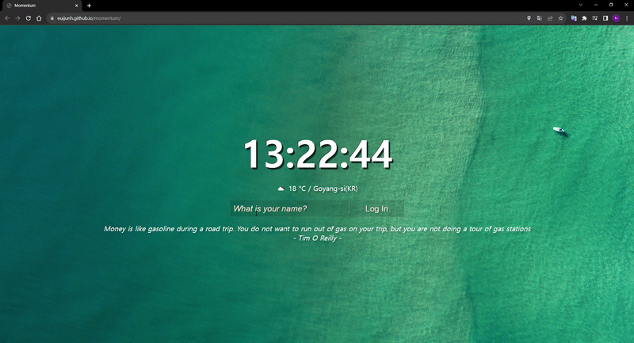

# [TODO List (Used Vanilla JS)](https://euijunh.github.io/momentum)

  

## 프로젝트 설명
TODO List를 작성할 수 있고 시계 기능과 날씨를 확인할 수 있는 momentum 크롬앱을 바닐라 자바스크립트를 이용해 클론코딩한 프로젝트입니다. 클론코딩 외에 반복되는 코드 줄이는 작업과 로그아웃 기능 추가 및 전체적인 스타일을 추가 해주고 로딩 아이콘(날씨)을 추가 하였습니다

## 주요기능
- **I Added Function**
  - [X] Style
  - [X] Logout Function
  - [ ] Reduce Repetitive Code

- [Clone Coding](https://nomadcoders.co/javascript-for-beginners)
  - JS Clock
  - Login (Local Storage)
  - JS TODO List (Local Storage)
  - Get Weather Information(open weather map API, Get Geolocation)

## 프로젝트 사용 방법
현재 시간을 확인할 수 있고 "내 위치 확인 권한 요청"을 허용하면 당신이 있는 장소의 기온, 날씨를 알 수 있습니다. 이름을 입력해 로그인하면 TODO List를 작성할 수 있고 로그아웃하면 이전에 작성하던 TODO List는 삭제됩니다.
